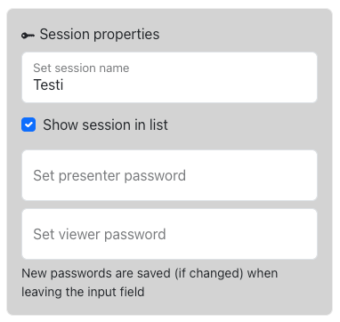
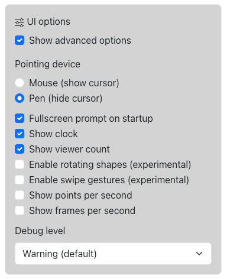
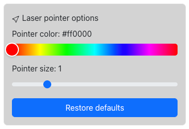

# Settings menu

## Session properties

Presenter and viewer passwords can be set here, as well as the presentation name and visibility on the Main page.
* Set session name: The name visible in the Home page listing (if listed). Cannot be empty.
* Show session in list: Whether to show the session in the Home page listing
* Set presenter password: Sets the password for editing the presentation. This is always required, and gives anyone who knows it full access to edit the session. Make sure to save the password somewhere, as there is no way to recover lost passwords. They can technically be changed using the admin tools on the server, but claiming the content as yours may be hard as no user accounts are used.
* Set viewer password: Sets the password for launching the viewer for this session. Can be empty.

## UI options

* Show advanced optionsEnables some advanced options that are mostly useful for development (marked with ADV below).
* Fullscreen prompt on startup: Uncheck this if you wish to skip the fullscreen prompt on startup for this presentation.
* Pointing device:
  * Mouse (show cursor): Shows the pen location with current color/size options when using the Draw tool.
  * Pen (hide cursor): Ignore any other touches except pen when using the drawing tools. Finger touch/mouse click will open a context menu, from which you can quickly change the tool used.
* Show clock: Show current time in the menu bar.
* Show viewer count: Show the current amount of viewers remotely connected to this presentation.
* Enable rotating shapes (experimental) (ADV): Enables rotation in the Transform shape tool. This is an experimental feature as it may give different results with different window aspect ratios.
* Enable swipe gestures (experimental) (ADV): Enables swipe gestures for undo/redo (2 fingers) and board navigation (3 fingers). This functionality is currently disabled by default as it does not work well with at least tablets.
* Show points per second (ADV): Shows the amount of line control points produced each second.
* Show frames per second (ADV): Shows the current frames per second displayed by the browser with a history graph (for performance checking/tuning).

### Laser pointer options

Set pointer color and size, or restore the default settings.

### Line options (ADV)

* Show points when drawing: Shows a circle around each control point for a brief moment while drawing a line. Can be used to tune the line settings to produce enough but not too many control points when drawing, so enough detail is preserved.
* Time between points: Sets the minimum time between two consecutive points on a drawn line. The default is 16ms, producing at most 63 control points per second.
* Min distance between points: Sets the minimum distance between two consecutive points on a drawn line. The distance is given as a percentage of the window width, and defaults at 0.2.
* Smooth lines: Checking this draws lines as bezier curves instead of a polyline with straight segments. This setting can also be controlled from the menu bar when using the Advanced UI.
* Line tension: Sets the tension parameter for bezier curves. Higher values will result in a more curvy line. A value of 0 will result in no interpolation.

### Clear (removes data from database)
* This board: Clears this board, removing all drawing data (not recoverable with Redo).
* All boards: Clears all boards, removing all drawing data (not recoverable with Redo). Keeps the presentation and passwords intact.
* The whole session: Removes the whole presentation from database, including all data, settings and passwords.

### Save / download
* Current board as PNG: Saves the current board as a PNG image using the pixel resolution of the current window.
* All boards as single PDF: Saves all the boards as a single PDF file to your local device (in a vector format).

### Replay current board (ADV)
The operations below will also be seen by viewers.
* Instant (sync board with database): Fetches and redraws the drawing data from database. Can be used to cure any graphical glitches that may have occurred.
* Realtime, skipping pauses: Same as above, but draws lines at the order and speed they were originally drawn, but skipping any pauses between lines.
* Realtime, including pauses: Same as above, but pauses are not skipped. **Note:** this option is not generally recommended for use as will last as long as the board has been drawn to (can be anything from seconds to years).