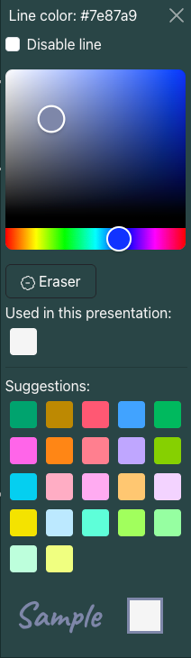
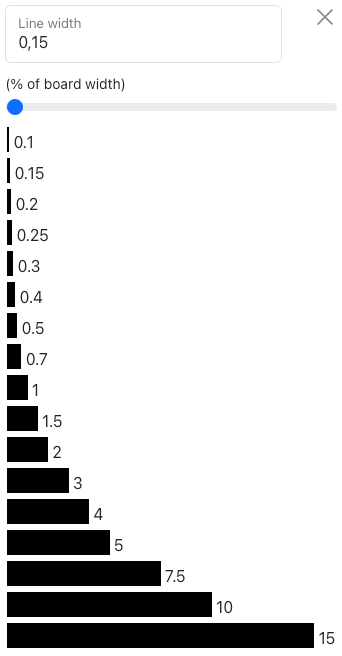
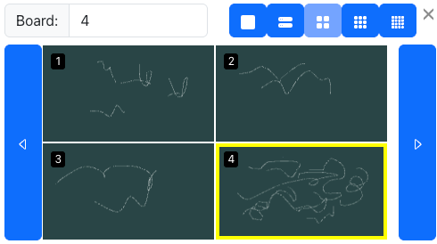
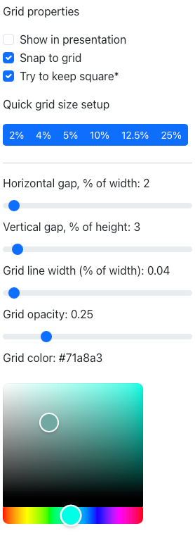
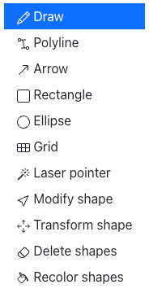
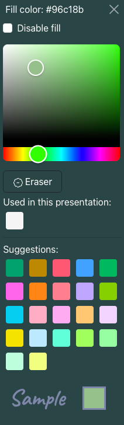
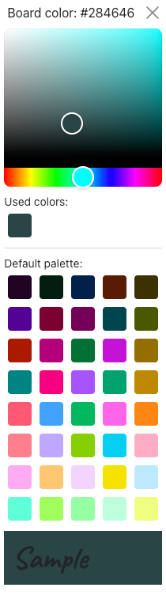
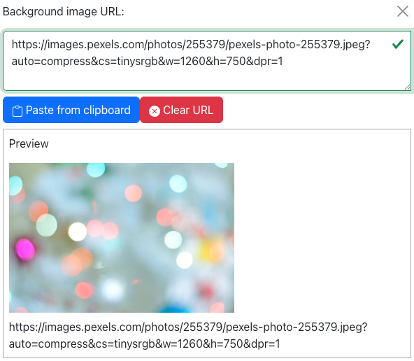
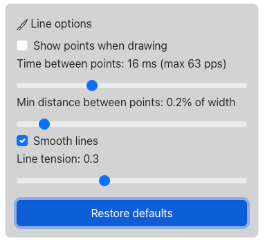

# Presentation editor
This is the view which opens when creating a new presentation, or clicking on the edit presentation button on the Home page session list.

## Overview
The Presentation editor is used to create presentation content. It comes with two switchable user interface (UI) options: *Simple UI* and *Advanced UI*. Simple UI is aimed only for casual/first-time, users who "just need to draw". Once you are familiar with the basics, switching to the Advanced UI is recommended to get access to all the tools and features, like arrows, polylines, grids, rectangles, circles, filled shapes, custom background colors or images, and editing shapes.

Note, that on narrow screens, the top menubar will shrink in size and contain less text, but all the buttons are still there.

## Getting started
When starting a new session, you are presented with the Simple UI with the draw tool selected, so you can just start writing and drawing using any pointing device supported by your browser. You can change the line width and color, and use a background grid and the laser pointer, create new boards and set up the viewer layout. If you need the other features, click on the "Simple UI" on top menubar, and select the "Advanced UI" from the menu that opens.

Everything you draw will be sent to the server and displayed for any viewers connected to your session. You can see the number of current viewers on the top menubar, next to the clock. By default, the viewers will see a 2x2 grid of boards, but you can change the layout from the top menubar. When you create more boards, the viewers will see the current board, as well as the previous three (unless they have set an offset for their local view).

For best experience, use a touch screen and a pen. This lets you use the quick menu for selecting the current drawing tool using a finger, while only the pen is used for drawing. When using a finger or mouse to draw, select "Mouse" as the pointing device (from either the settings sidebar, or by clicking on the icon showing the current mode (pen/mouse) in the top navigation bar).

## Functions available in both Simple and Advanced UIs

### Settings sidebar 
This icon opens a sidebar with some less often used settings for the current presentation. These are covered in detail on a [separate page][client-settings.md].

### UI selection 
Here you can switch between Simple and Advanced user interfaces. Most settings done on the Advanced UI carry on to the Simple UI if you change the mode, with the exception of drawing tools that do not exist in the Simple UI, and the fill settings for lines (simple UI does not support the creation of filled shapes). Changing modes does not affect the content you have created, so feel free to change between UI modes whenever you like.

### Tools

#### Draw 
The default tool, used to draw lines and produce hand-written text. To learn more about how lines are constructed in Blackboard 2.0, and to see how you can control the line quality using advanced settings, please see the [Tuning line settings chapter](#tuning-line-settings) later in this document.

In Advanced UI, you can also quickly switch line smoothing on/off using the  icon on the top menubar.

Note: Long lines will update periodically (without animation) for viewers to avoid long delays from drawing to display. Currently updating is done once for every 50 control points, so update frequency will depend on the current line settings.

Note 2: the Draw tool never snaps to grid. If you need straight lines, use the Polyline or Arrow tools.

#### Laser pointer 
Laser pointer is shown as a colored dot in the UI, which follows your cursor/pen/finger. The pointer is also visible for all viewers of your presentation – and unlike in the presentation UI, it has a trail making it easier to follow. The pointer color can be adjusted from Settings.

#### Delete shapes / Batch delete 
The Delete lines tool removes existing lines from the presentation as objects, not like a regular blackboard eraser. To erase only parts of lines, choose "Board (eraser)" as the color from the Line color menu. Deleted lines can be restored using the Redo button.

### Line properties

#### Line color 

Changes the current line color for shapes. Colors already used in the presentation are listed first.
Eraser is a special "color" which mimics a blackboard eraser, as it essentially clears anything drawn below it. Note: when saving as PDF, the eraser-colored lines are drawn in background color, which looks bad if you use a background image. A workaround is to save these pages one by one as PNG, and add to the PDF manually.

Pick allows you to pick any color from your screen (disabled in some browsers due to unstable implementation).

Suggestions are picked from a static palette, taking into account the current board color so there is enough contrast. An exclamation mark in "Used in this presentation" means there is not enough contrast with the current background color.

Note: In addition to suggested colors, Advanced UI includes a visual selection tool for picking the color freely.

#### Line width 

The line width menu in Simple UI includes a few common options. The width values are measured as a percentage of the current window width, and will scale if the window width changes.

Note: Advanced UI allows more width options, as well as a slider and manual (text) width input.

### Undo and redo 
Please note, that a "proper" undo functionality is not currently implemented, so you cannot undo any UI changes or such – only mark lines (or other shapes) as removed so they will not be drawn but remain in the database.

#### Undo
Undo marks the last drawn/redone line as removed.

#### Redo
Redo resets the status of the last line marked as removed.

### Board navigation 

From left to right, the board navigation panel contains the following buttons:
1. Go to first board
2. Go to previous board
3. Open the navigation menu (see below) to adjust the viewer configuration or visually navigate the boards. Current viewer grid configuration and board number is indicated in the button.
4. Go to next board (creates a new board if it does not exist)
5. Go to last board (last board number indicated in the button)

You can change the number of boards (1/2/4/9/16) visible for viewers at once by clicking on one of the five grid buttons in the top of menu.

You can change the current board by either:
Clicking on a preview of the desired board (board numbers are shown in the top left corner of each preview, and the currently active board is highlighted in yellow).

Typing a board number in the text field (will be created if it does not exist).
Board previews can be navigated (without affecting the boards visible for viewers) by clicking on the tall arrow buttons on each side.

You can use the tall buttons on each side of the board previews to move one "page" at a time to either direction.

Note: When creating a new board, color and background grid settings are copied to it **from the previously active board**.

### Background grid setup 

The button with a grid icon toggles the background grid on and off. Click on the down arrow next to it to adjust grid properties. Background grid properties, like the background color, can be set differently for each board.

* **Show in presentation**:  The grid is also shown for viewers (shown only for the presenter by default)
* **Snap to grid**: (not available in Simple UI as draw tool never snaps to grid) Drawing tools other than Draw will always align their size to grid squares.
* **Try to keep square**: (see note below) When set, vertical and horizontal size sliders (see below) are interconnected so that the resulting grid cells would be as close to square as possible with the current board aspect ratio.
* **Horizontal gap, % of width**: Set the horizontal size of cells in the grid, measured as percentage of window width.
* **Vertical gap, % of height**: Set the vertical size of cells in the grid, measured as percentage of window width.
* **Grid line width (% of width)**: Sets the grid line width (as a percentage of window width).
* **Grid opacity**: Sets the grid transparency/opacity. 0 = fully transparent, 1 = fully opaque.
* **Grid color**: Sets the grid color.

Note: Grid cells are (nearly) square for the presenter, but only as long as the aspect ratio remains the same. Do not assume the grid is square for viewers, or when saving to PDF.

If the grid size is changed, objects may no longer align to the grid. Changing the window size or aspect ratio should keep the alignment intact, although the grid may appear stretched.

### Full screen toggle 
Toggles the full screen mode on/off.

Note: The exact effect and exit methods depend on the used OS. Typically esc will get you out of the full screen mode, if the toggle does not work.

Full screen mode does not work on Chrome for iOS/iPadOS due to OS security limitations. On Safari it does, but not very well.

Workaround for iPadOS/iOS, tested in version 15.3.1:
1. Open Blackboard 2.0 in iOS/iPadOS Safari (do not choose to enter full screen)
2. Click on the "share" icon on top right (box with an arrow pointing up from it)
3. Select the option "Add to home screen" ("Lisää Koti-valikkoon" in Finnish). If the option is not visible, scroll down and select "Edit actions..." ("Muokkaa toimintoja..." in Finnish), then add the action to the menu.
4. Click "Add". You should now have an icon on your home screen which opens the Blackboard 2.0 in a proper full screen mode.

### Info display 
The main info display area displays the current time and number of current presentation viewers. Both of these can be disabled from the Settings sidebar if desired.

In Advanced UI, there is an additional toggle/indicator for switching between mouse and pen/touch as the drawing device.

### Save and Quit

#### Save PDF 
Saves the current presentation as a PDF file to the local system. The presentation will remain in the database until deleted even if you don't use the save option, but it's always wise to save a PDF backup in case of a server crash/data loss.

#### Quit 
Closes the presentation session, saving settings and returning to Main page. It is recommended to exit via this button, as otherwise your session settings like the active board and viewer configuration are not saved.

## Functions available in Advanced UI only

The functionality below is only available when the Advanced UI is selected.

### Draw menu 

#### Polyline
Creates a path (line) through two or more control points. The line can be either rough or smooth, and also have a fill.

Control points are created when the pointer is released (lifted). The control point locations are indicated by a circle around the point. Polyline is finished by clicking on an existing control point (the circle changes color to indicate that you can end the polyline on it). Changing the tool or navigating away from current board will also end the polyline, but for consistent results, you should finish it manually.

Polyline will refresh for the viewers after a new control point is created.

#### Arrow
Creates simple arrows with one drag across the board (any direction). The arrow is saved when the pointer is released. Arrows need to have a line color to be visible. Fill is not supported at this time.

#### Rectangle
Creates rectangles with one drag across the board (any direction). Supports fill and disabling line.

#### Ellipse
Creates rectangles with one drag across the board (any direction). Supports fill and disabling line.

#### Grid
Creates a regular grid with one drag across the board (from top left only at this time). Grid spacing follows the current board background grid settings (background grid does not need to be visible). It is recommended to have Snap to grid checked when using this tool, so things will line up better and grids are always complete with right/bottom borders present. Fill is not supported, but you can create a filled rectangle (or many) on top of the grid and use Move to back to let the grid show on top of it. Disabling line has no effect on grids.

#### Modify shape
This tool lets you change the properties of a shape already drawn on the board by pointing on it. This will open a context menu with options to choose from. The options available depend on the type of shape, as well as the selected line properties.  You can, for example, clone shapes, change the line/fill color or line width to match the current settings, and add/remove fills or line smoothing.

#### Transform shape
This tool lets you move and scale shapes. You can just click/tap on a shape and start moving it, or scale using any of the handles.

Rotation is also available, but it needs to be separately activated from the Settings: Show advanced options → Enable rotating shapes (experimental). The reason this is not enabled by default is, that due to the way object scaling is currently implemented for the viewer, the end result may be different in the presenter's and viewer's screen. Also object rotation is not yet supported when saving as PDF (rotation is ignored).

#### Batch delete
(Same as "Delete lines" in Simple UI, see above)

#### Batch recolor
Works like Batch delete, but instead of marking shapes as deleted, it changes their line color to currently selected.

### Line properties (Fill color) 

Lines and shapes can have a fill when using the Advanced UI. The menu is similar to line color menu.

Note: When fill is enabled, free form lines are automatically closed (start and end points are connected). You can later open the line using the Modify Shape tool, but that will also disable the fill.

### Smooth lines toggle 
The smooth lines toggle allows you to quickly switch between smooth and sharp lines. This visual aid is useful especially when using the polyline tool, although the smoothing is automatically turned off when switching to Polyline tool, and back on when switching to Draw.

Note: when in Simple UI, lines are always smoothed by default.

### Board color 

Lets you change the board color. The menu is quite similar to line and fill color menus, although slightly simpler. Each board has its own color (and grid) settings, and these settings from the previously active board are copied into a newly created board.

### Board background image 

This menu (click on the down arrow) lets you load a background image for the current board. Blackboard 2.0 does not store image data, so you can not upload an image, but it needs to be available in the Internet as an URL. If using some internal server (behind a firewall) for images, note that in order for the viewers to view the image, they also need direct access to its URL.

Once defined, the image can be switched on/off by clicking on the image icon.

## Tuning line settings

You can access the Line options by checking the *Show advanced options* box in the *Settings and Extras sidepanel*.

### Line options in the Settings sidebar

Lines are saved in vector format, i.e. as control points, which determine how the actual line is drawn. If line smoothing is used, the actual line may not pass through the control points – but if not, they always will. Non-smoothed lines need more control points, otherwise they will look rough. On the other hand, smoothed lines may lose some details, especially if your handwriting is small.

You can adjust/disable the smoothing and the amount of control points produced per millisecond, or by a minimum distance between control points, using the Settings sidebar. The default settings should fit most common use cases, but depending on the speed and size of your handwriting you may need to make adjustments. See the [settings page][client-settings.md] for details. Note, that if your lines are not detailed enough due to the device being slow, adding more control points will likely make the situation worse.