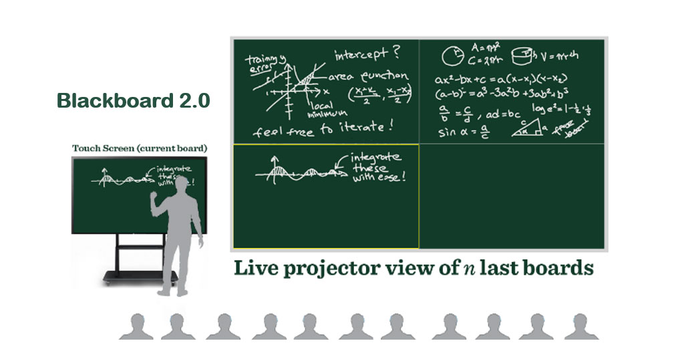

# Blackboard 2.0 - a virtual blackboard

The aim of Blackboard 2.0 is to make it possible to hold "blackboard-like" lectures on venues which don't have physical blackboards installed, but do have one or more large displays or projection surfaces. The presenter (typically a lecturer) can create "boards" (= virtual blackboards) on any touch screen device, and present them using one or more projectors as a tiled view of one or more boards. If the server is visible to the Internet, viewers can also follow the lecture in real time using their own devices from anywhere.

While the primary use case is for lectures, the application is not restricted to this context. However, communication is currently one-way, which limits its effectiveness in collaborative scenarios.

## User roles
Blackboard 2.0 has two user roles: *presenter* and *viewer*. The presenter draws on (preferably) a touch screen, and the viewers see the results in (almost) real time on bigger screens with a configurable number of "boards" for each. It is also possible to follow the presentations using your own device by just opening a viewing session from either the landing page, or via a direct URL.

## Components
There are three main components in Blackboard 2.0 (see links for documentation):
1. Client, consisting of two parts:
    * [landing page][home.md] (used to create new Blackboard sessions and join existing ones)
    * [drawing app][client.md] (used by the presenter, a React app)
2. [Viewer][viewer.md] (a static HTML page with JavaScript, handles showing the data)
3. Server (a Node.js app and a Postgres database; persists drawing data). The server documentation can be found at the Blackboard 2.0 main GitHub repository (README.md).

The above components communicate with each other mainly by passing messages around through websockets, so the viewers can react immediately for any changes by the presenter. There is also a virtual laser pointer for the presenter to highlight parts of the board for viewers.

## Usage
In order to create Blackboard sessions, the server needs to be installed and reachable from your local device (see the README on GitHub for details on server installation and usage). You can run Blackboard 2.0 client and viewer on any modern browser, using your computer or tablet – or even a phone, although the menubar probably won't fit into one row. A touch screen is highly recommended for the presenter, but using a mouse is also supported for testing purposes.

## License
Blackboard 2.0 is published under the MIT license, meaning you can use it pretty much without restrictions. If you make improvements to the code, feel free to create a pull request.