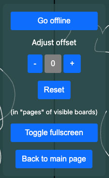
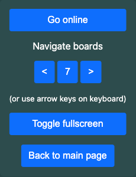

# Presentation viewer
The presentation viewer is used to display a presentation in real time in a grid view of 1-16 simultaneous boards. The currently active board (the one the presenter is viewing) is highlighted with yellow borders.

The presentation viewer is typically something you just launch and watch, while the presenter is responsible for navigating and setting the number of boards visible at once. There are, however, some tools available when you move the mouse cursor over the viewer window.

## Tools in online mode only

### Go offline
Click to disconnect the websocket connection to the server. You can then take control of navigation (one board at the time) using either the back/forward navigation buttons on the UI, or the left and right arrow keys on the keyboard. [^1]

### Adjust offset
Here you can set the current view to be ahead or behind the current board being worked on by the presenter. The number you set here is always in *multiples of boards currently visible in the viewer*. So if the viewer is set to show four boards at once, setting offset to -1 will show you the four boards previous to the current view. To skip ahead (in case there are more boards), a positive offset will show the next four boards. Uninitialised boards will just display the board number. The reset button will return the offset to zero.

The offset is mainly provided to display a longer history of boards at the presentation venue in case there are multiple projectors, but it can also be used to fetch all the boards to the browser's cache for offline usage ([^1]).

## Tools in offline mode only

### Go online
Tries to reconnect to the live presentation. Sets the board layout like the presenter has set it up, and resumes viewing from whatever board the presenter has last navigated into. This will refresh any boards in the current view, but not those outside of it.

### Navigate boards
Freely navigate from board to board (one at the time) using either the back/forward navigation buttons on the UI, or the left and right arrow keys on the keyboard. [^1]

## Tools common to both modes

### Toggle fullscreen
Click to expand the viewer window to fill your screen, depending on if and how the browser on your device lets you do it.

### Back to main page
Click to return to the Home page with the listing of available presentations.

---
[^1]: Note: in offline mode, *you can only browse the boards which your browser has "seen"*, i.e. saved into its local storage. It is currently not possible to automatically fetch any missing boards from the presentation for offline usage, but (while still in online mode) you can work around this by setting the offset repeatedly so that each board is visible at least once. Note, that this is not a good solution for permanent storage for presentations, and you should instead ask for a saved pdf of the presentation from the creator.